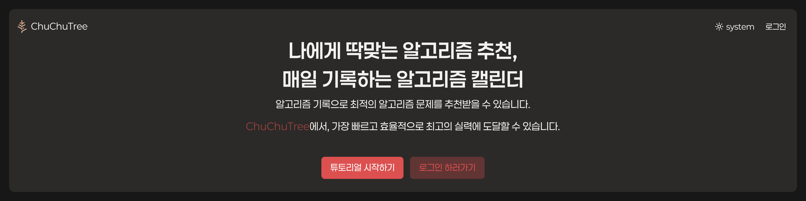
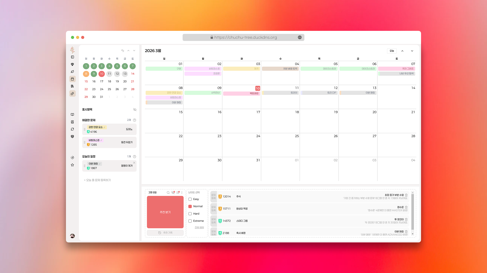
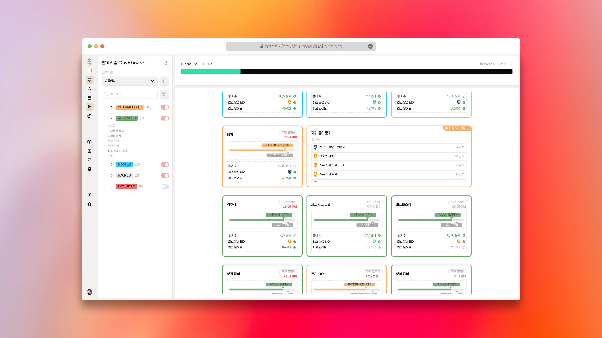

# ChuChuTree

**오늘 내가 풀어야 할 알고리즘 문제, ChuChuTree가 골라줍니다.**

나의 알고리즘 풀이 이력과 유형별 숙련도를 분석해 나에게 딱 맞는 문제를 추천하는 알고리즘 학습 관리 서비스입니다.

 

**👉 [ChuChuTree 시작하기](https://chuchu-tree.duckdns.org/)** | [ 노션 개발로그](https://rural-cloche-ff3.notion.site/ChuChuTree-31f1651a841680119a09d19d8f1f282c?source=copy_link)

 

---

### 📅 알고리즘 캘린더 + 나만의 최적 문제 추천

- 월별 달력에서 나의 풀이 기록을 한눈에 확인할 수 있습니다.
풀 예정 문제를 미리 등록해두거나, 날짜별로 어떤 알고리즘 유형을 풀었는지 색상으로 구분해 볼 수 있습니다.

- 나의 알고리즘 풀이 이력을 분석해 오늘 풀기에 최적인 문제를 추천합니다.
- 난이도와 알고리즘 유형을 직접 선택해 원하는 방향으로 학습할 수 있습니다.

---

### 📊 유형별 숙련도 대시보드

- 내가 어떤 알고리즘 유형을 잘하고, 어디가 부족한지 한눈에 파악할 수 있습니다.

- 60여 개 알고리즘 태그마다 INTERMEDIATE → ADVANCED → MASTER 3단계 숙련도를 추적합니다.
유형별로 내가 풀었던 문제들을 확인할 수 있습니다.

---

### 👥 스터디 그룹

- 혼자가 아닌 함께 공부하고 싶다면 스터디 그룹을 만들어 보세요.

- 팀원을 초대하고, 팀 기반 문제 추천을 받아 함께 학습할 수 있습니다.

 

## 운영자

[진우석](https://github.com/jinwooseok) + [임남기](https://github.com/namgi2386)  

 

---

## 이용약관 및 개인정보 처리방침

- [이용약관](https://chuchu-tree.duckdns.org/policies/terms-of-service)
- [개인정보 처리방침](https://chuchu-tree.duckdns.org/policies/privacy)
